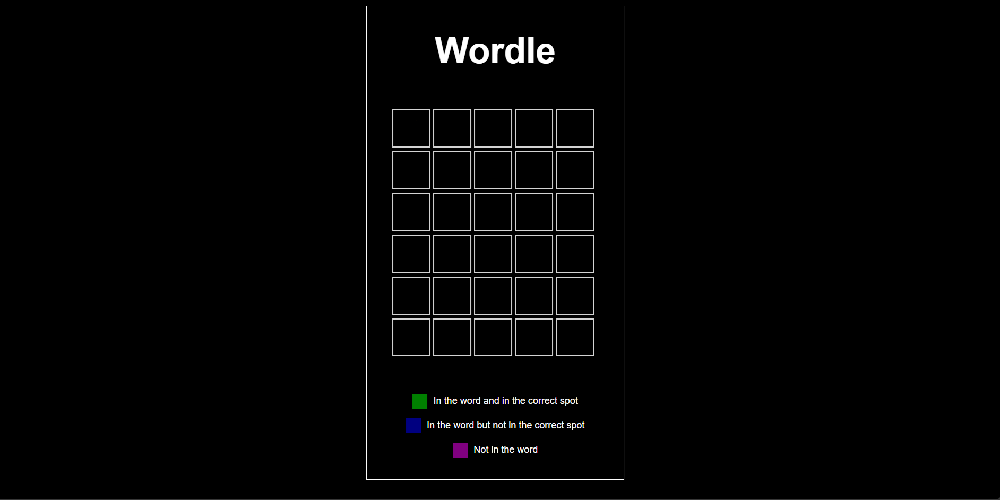
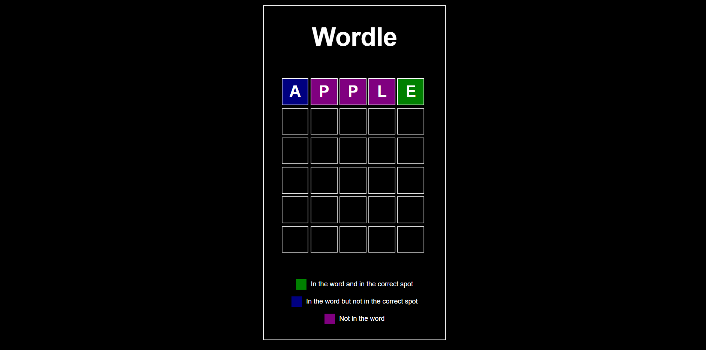
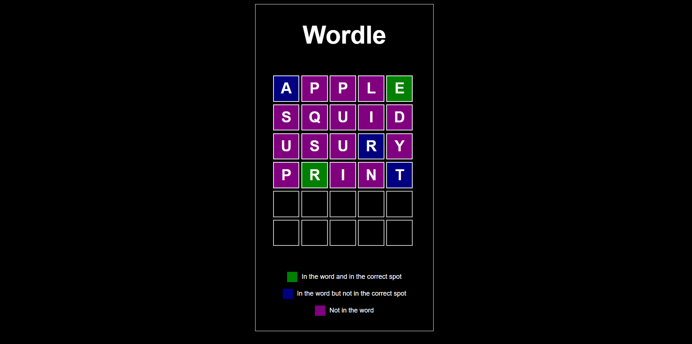

# WORDLE
i think we all know how wordle works still there will be a how to play below, also its minified with terser making it run on a data uri locally on your computer it does not need a server to host itself. 

## HOW TO PLAY
Guess the correct 5 letter word, you have 6 chances to guess it.
Certain colors means certain things regarding the guessed letter being in the word:
Green- it is in the word and in the correct spot.
Blue- it is in the word but not in the correct spot.

theres only one word for now, it reveals the answer after you use all the 6 attempts.

## SCREENSHOT

